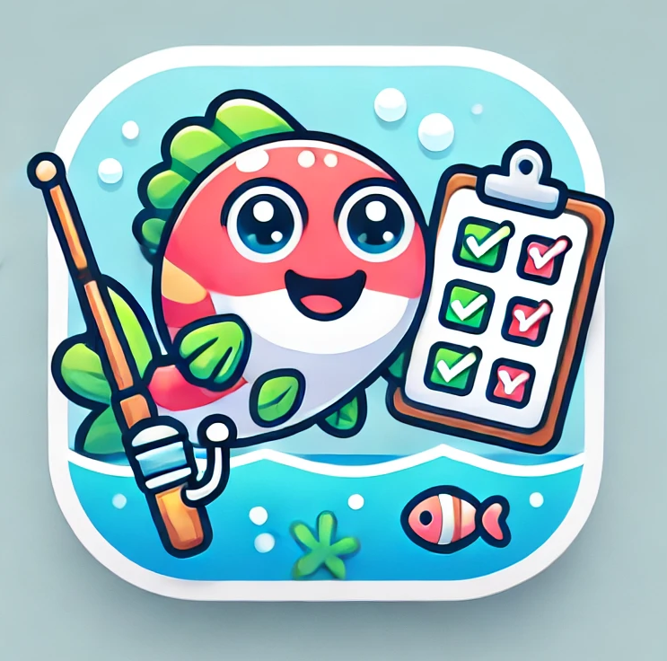

# Fish Live Dex



## Introduction
Fish Live Dex is an application designed to help users track their fishing catches and learn about various fish and animal species. It solves the problem of keeping a comprehensive record of fishing trips by allowing users to store detailed information about their catches, including photos, species, date, time, and gear used. Additionally, Fish Live Dex provides a checklist feature to help users identify fish species available in their region using geolocation data and external APIs. Fishermen can see what they’ve caught and what they’ve yet to find, making their fishing experience more organized and engaging.

## Installation

### Prerequisites
- [Node.js](https://nodejs.org/) installed
- Any package manager such as npm or yarn
- Internet connection for fetching data from external APIs

### Steps to Install

1. **Clone the repository:**
   ```bash
   git clone https://github.com/yourusername/fish-live-dex.git
   cd fish-live-dex
   ```

2. **Install dependencies:**
   ```bash
   npm install
   ```

3. **Set up environment variables:**
   Create a `.env` file in the root directory and add any necessary API keys and configuration (e.g., external APIs for geolocation and fish data).

4. **Start the development server:**
   ```bash
   npm run dev
   ```

5. **Access the app:**
   Open your browser and go to `http://localhost:3000`.

## Usage

Once the app is set up and running, users can:

1. **Record catches**: Upload a photo, input the fish species, record the date, time, and any additional information such as gear used.
   
2. **View your catches**: Keep track of all the fish you’ve caught in a detailed, filterable list.
   
3. **Check available fish in your region**: Use geolocation to see which fish species are available in your area, and compare them with your catch list.
   
4. **Explore species**: Search and learn more about fish and other animal species using external APIs.

## Contributing

Contributions are welcome! Here’s how you can contribute:

1. Fork the repository.
2. Create a new branch (`git checkout -b feature/my-new-feature`).
3. Make your changes.
4. Commit your changes (`git commit -am 'Add new feature'`).
5. Push to the branch (`git push origin feature/my-new-feature`).
6. Create a new Pull Request.

### Reporting Bugs and Requesting Features

- Open an issue [here](https://github.com/yourusername/fish-live-dex/issues) to report bugs or request new features.
- Make sure to provide a detailed description of the bug or feature, and steps to reproduce (if applicable).

## License

This project is licensed under the MIT License. See the [LICENSE](LICENSE) file for more details.
